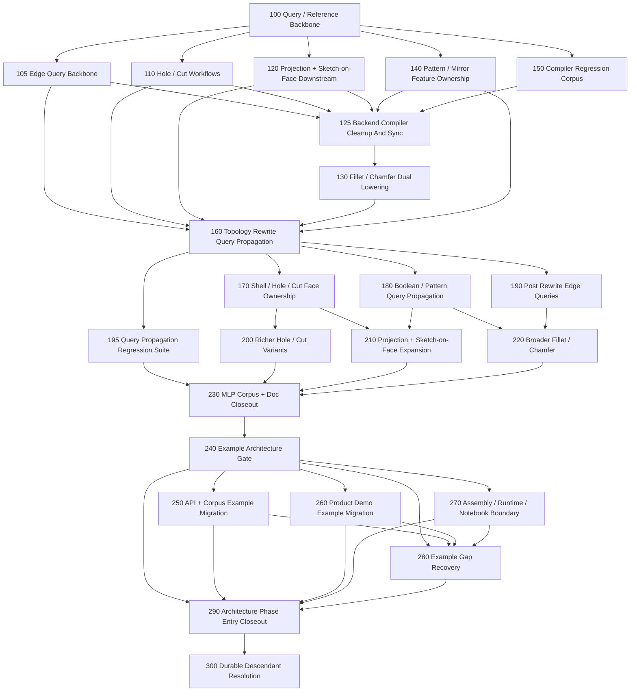
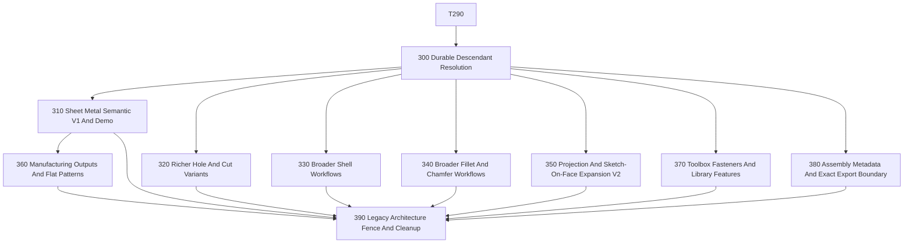

# Task Graph

Date: 2026-03-13

This is the multi-agent execution plan for the backend compiler program.

## Current Landed Base

Completed foundations and slices:

- [tasks/100-query-reference-backbone.md](../../../../../../tasks/100-query-reference-backbone.md)
- [tasks/105-edge-query-backbone.md](../../../../../../tasks/105-edge-query-backbone.md)
- [tasks/110-hole-and-cut-workflows.md](../../../../../../tasks/110-hole-and-cut-workflows.md)
- [tasks/120-projection-and-sketch-on-face-downstream.md](../../../../../../tasks/120-projection-and-sketch-on-face-downstream.md)
- [tasks/125-backend-compiler-cleanup-and-sync.md](../../../../../../tasks/125-backend-compiler-cleanup-and-sync.md)
- [tasks/130-fillet-and-chamfer-dual-lowering.md](../../../../../../tasks/130-fillet-and-chamfer-dual-lowering.md)
- [tasks/140-pattern-and-mirror-feature-ownership.md](../../../../../../tasks/140-pattern-and-mirror-feature-ownership.md)
- [tasks/150-compiler-regression-corpus.md](../../../../../../tasks/150-compiler-regression-corpus.md)
- [tasks/160-topology-rewrite-query-propagation.md](../../../../../../tasks/160-topology-rewrite-query-propagation.md)
- [tasks/170-shell-hole-cut-face-ownership.md](../../../../../../tasks/170-shell-hole-cut-face-ownership.md)
- [tasks/180-boolean-pattern-query-propagation.md](../../../../../../tasks/180-boolean-pattern-query-propagation.md)
- [tasks/190-post-rewrite-edge-queries.md](../../../../../../tasks/190-post-rewrite-edge-queries.md)
- [tasks/195-query-propagation-regression-suite.md](../../../../../../tasks/195-query-propagation-regression-suite.md)

What that gives the next lane:

- shared face and edge query/reference contracts
- richer hole/cut workflows, broader projection replay, repeated-result ownership, and broader tracked-edge finishing in the compiler-owned subset
- curated multi-feature corpus coverage in compiler and exact-export checks

This is the landed base that task 230 closed out instead of inventing new provenance or regression surfaces locally.

## Current Wave

The topology-rewrite wave, the MLP closeout, and the full post-MLP example
phase are now landed.

The landed post-160 feature wave was:

- [tasks/200-richer-hole-and-cut-variants.md](../../../../../../tasks/200-richer-hole-and-cut-variants.md)
- [tasks/210-projection-and-sketch-on-face-expansion.md](../../../../../../tasks/210-projection-and-sketch-on-face-expansion.md)
- [tasks/220-broader-fillet-and-chamfer.md](../../../../../../tasks/220-broader-fillet-and-chamfer.md)

The closeout lane for that wave was:

- [tasks/230-mlp-corpus-and-doc-closeout.md](../../../../../../tasks/230-mlp-corpus-and-doc-closeout.md)

The landed example-phase wave after MLP was:

- [tasks/240-example-architecture-gate-and-manifest.md](../../../../../../tasks/240-example-architecture-gate-and-manifest.md)
- [tasks/250-api-and-corpus-example-migration.md](../../../../../../tasks/250-api-and-corpus-example-migration.md)
- [tasks/260-product-demo-example-migration.md](../../../../../../tasks/260-product-demo-example-migration.md)
- [tasks/270-assembly-runtime-notebook-example-boundary.md](../../../../../../tasks/270-assembly-runtime-notebook-example-boundary.md)
- [tasks/280-example-gap-recovery-and-legacy-fence.md](../../../../../../tasks/280-example-gap-recovery-and-legacy-fence.md)
- [tasks/290-architecture-phase-entry-closeout.md](../../../../../../tasks/290-architecture-phase-entry-closeout.md)

## Dependency Graph

## Program State

- Landed: 100, 105, 110, 120, 125, 130, 140, 150, 160, 170, 180, 190, 195, 200, 210, 220, 230, 240, 250, 260, 270, 280, and 290.
- Landed post-160 feature wave: 200, 210, 220, with 230 as the MLP closeout lane.
- Landed post-MLP example phase: 240, 250, 260, 270, 280, and 290.
- Architecture-phase verdict: yes for the maintained example surface; the deeper checkpoint is still blocked by task 300.

## Next Up

1. Start [tasks/300-durable-descendant-resolution-and-topology-ownership.md](../../../../../../tasks/300-durable-descendant-resolution-and-topology-ownership.md).
   - It is the deepest remaining blocker after the phase-entry review.
   - It turns lineage and rewrite propagation into defended descendant surfaces, edge chains, and downstream-owned topology.
2. Keep the next feature-breadth wave behind task 300 instead of parallelizing too early.
3. Use the follow-on wave only after the shared descendant-resolution contract is real:
   - task 310
   - task 320
   - task 330
   - task 340
   - task 350
   - task 370
   - task 380
4. Start task 360 after task 310, and keep task 390 as the cleanup/retirement lane.

## Planned Next Wave

The next planned wave after the phase-entry closeout is:

### Recommended Execution Order

1. Start task 300 first. It is the deepest remaining shared blocker.
2. After task 300 lands, these lanes can run largely in parallel:
   - task 310
   - task 320
   - task 330
   - task 340
   - task 350
   - task 370
   - task 380
3. Start task 360 after task 310.
4. Use task 390 as the retirement lane after the replacement paths are real.

### Isolation Notes

Task 300:

- is the central contract lane and will touch the most shared files

Task 310:

- should prefer new sheet-metal modules and one strong demo instead of widening generic solid APIs carelessly

Task 320:

- should stay centered on hole/cut modules, descendant usage, and targeted regression cases

Task 330:

- should stay centered on shell semantics and shell-created face ownership

Task 340:

- should stay centered on finishing and edge-chain descendant handling

Task 350:

- should stay centered on projection and sketch-on-face semantics

Task 360:

- should stay mostly in export/CLI/docs/regression surfaces once task 310 exists

Task 370:

- should mostly live in library/example/documentation surfaces and compose existing semantic features

Task 380:

- should stay focused on assembly metadata and composition boundaries, not part-feature internals

Task 390:

- is the cleanup lane and should not be started until the replacement paths are real

## Parallel Starts

These intentionally parallel sets are now landed:

- task 200
- task 210
- task 220
- task 250
- task 260
- task 270

They were separated by logic:

- task 200 stays in richer hole/cut family behavior
- task 210 stays in projection/sketch-on-face expansion
- task 220 stays in broader finishing on defended propagated edges
- task 250 stayed in API parts plus compiler-corpus migration
- task 260 stayed in product/demo part migration
- task 270 stayed in the non-part example boundary

The example phase then closed through:

- task 280
- task 290

## Merge Strategy

There is still one unavoidable shared surface area:

- `src/forge/compilePlan.ts`
- `src/forge/compilePlanManifold.ts`
- `src/forge/compilePlanCadQuery.ts`
- a few public API entry files

To keep agent work mergeable, use this operating model:

1. Feature agents build new feature logic in isolated modules first.
2. Each feature task should minimize central-file edits to a thin integration seam.
3. One integrator agent batches the small shared-file merges onto the program branch.

That keeps feature implementation parallel while acknowledging the real shared compiler seam.

## Recommended Team Topology

Core integrator lane:

- owns the program branch
- reviews query/lowering contracts
- batches the thin shared-file integration edits

Next planning lane:

- keep task 300 narrow using the blocker list from `mlp-readiness-review.md`
  and `architecture-phase-entry-review.md`

Quality support:

- Tasks 195, 230, 240, 280, and 290 are landed, and the active truthfulness
  surface is now the compiler corpus plus the checked example gate plus the
  phase-entry review package

## File-Ownership Guidance

Task 105:

- may touch `src/forge/queryModel.ts`, `src/forge/sketch/topology.ts`, `src/forge/sketch/workplane*.ts`, and placement invariants
- should not implement fillet/chamfer behavior yet

Task 110:

- should prefer new feature modules and its own check/docs files
- should consume the shared face-query model and avoid changing query semantics

Task 120:

- should stay centered on projection/sketch-on-face semantics and exporter/runtime parity
- should avoid changing hole workflow files

Task 140:

- should focus on downstream ownership for repeated/mirrored feature results
- should avoid projection internals where possible

Task 150:

- should mostly live in `examples/`, `cli/check-*.ts`, and snapshot baselines
- should avoid core semantic changes

Task 125:

- should focus on task/docs/corpus/tracker truthfulness
- should avoid changing feature semantics unless the cleanup exposes a real bug

Task 160:

- may touch `src/forge/queryModel.ts`, new propagation-focused modules, `src/forge/compilePlan.ts`, and query inspection/check surfaces
- should not widen specific feature families beyond what is required to prove the propagation backbone

Task 170:

- should focus on shell/hole/cut created-face ownership and downstream workplane integration
- should avoid projection and edge-finishing internals

Task 180:

- should stay centered on boolean/pattern descendant propagation
- should avoid shell/hole/cut and projection internals where possible

Task 190:

- should focus on propagated edge-query semantics and edge-resolution helpers
- should avoid broadening finishing behavior itself

Task 195:

- should mostly live in `examples/compiler-corpus/`, dedicated check files, snapshots, and small docs
- should avoid core semantic changes unless a case exposes a real bug

Task 200:

- should stay centered on richer hole/cut variants after task 170
- should avoid projection and edge-finishing internals

Task 210:

- should stay centered on projection/sketch-on-face expansion after tasks 170 and 180
- should avoid hole/cut and finishing internals where possible

Task 220:

- should stay centered on broader finishing after tasks 180 and 190
- should avoid reworking hole/cut or projection logic

Task 300:

- is the shared descendant-resolution contract lane and should avoid getting widened into general feature breadth

Task 310:

- should stay centered on the dedicated sheet-metal semantic family and its proof model

Task 320:

- should stay centered on richer hole/cut variants after task 300
- should avoid projection and finishing internals where possible

Task 330:

- should stay centered on broader shell semantics and shell-created face ownership after task 300

Task 340:

- should stay centered on broader finishing after task 300
- should avoid reworking hole/cut or projection logic

Task 350:

- should stay centered on broader projection/sketch-on-face semantics after task 300
- should avoid hole/cut and finishing internals where possible

Task 360:

- should stay centered on manufacturing-oriented outputs after task 310
- should avoid inventing exporter-only geometry behavior

Task 370:

- should mostly live in library/example/docs surfaces and compose supported semantic features

Task 380:

- should stay focused on assembly metadata/export boundary rather than full mate-system work

Task 390:

- should inventory and fence legacy architecture paths only after the compiler-owned replacements are real
