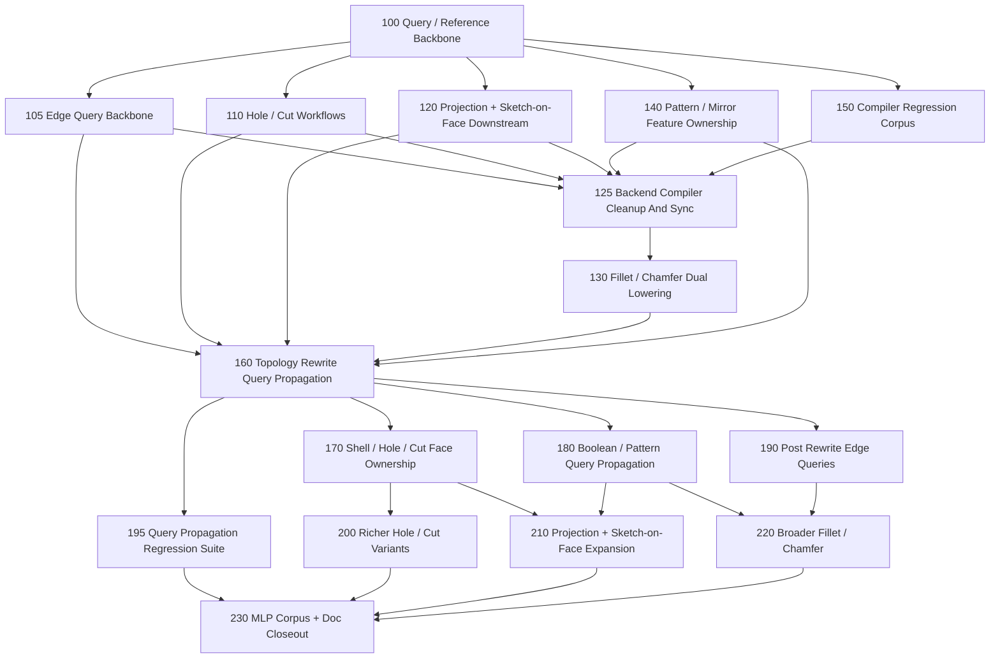

# Task Graph

Date: 2026-03-12

This is the multi-agent execution plan for the backend compiler program.

## Current Landed Base

Completed foundations and slices:

- [tasks/100-query-reference-backbone.md](../../../../../../tasks/100-query-reference-backbone.md)
- [tasks/105-edge-query-backbone.md](../../../../../../tasks/105-edge-query-backbone.md)
- [tasks/110-hole-and-cut-workflows.md](../../../../../../tasks/110-hole-and-cut-workflows.md)
- [tasks/120-projection-and-sketch-on-face-downstream.md](../../../../../../tasks/120-projection-and-sketch-on-face-downstream.md)
- [tasks/125-backend-compiler-cleanup-and-sync.md](../../../../../../tasks/125-backend-compiler-cleanup-and-sync.md)
- [tasks/130-fillet-and-chamfer-dual-lowering.md](../../../../../../tasks/130-fillet-and-chamfer-dual-lowering.md)
- [tasks/140-pattern-and-mirror-feature-ownership.md](../../../../../../tasks/140-pattern-and-mirror-feature-ownership.md)
- [tasks/150-compiler-regression-corpus.md](../../../../../../tasks/150-compiler-regression-corpus.md)

What that gives the next lane:

- shared face and edge query/reference contracts
- hole/cut v1, projection replay v1, repeated-result ownership, and tracked-edge finishing v1 in the compiler-owned subset
- curated multi-feature corpus coverage in compiler and exact-export checks

This is the base that task 130 consumed instead of inventing new provenance or regression surfaces locally.

## Next Core Lane

The deepest next piece is:

- [tasks/160-topology-rewrite-query-propagation.md](../../../../../../tasks/160-topology-rewrite-query-propagation.md)

This is the next single-threaded architectural lane. Do not start the broader feature wave before this lands.

## Dependency Graph

## Program State

- Landed: 100, 105, 110, 120, 125, 130, 140, and 150.
- Active next lane: 160.
- Immediate parallel wave after 160: 170, 180, 190, 195.
- Second wave after that: 200, 210, 220.
- MLP closeout lane: 230.

## Next Up

1. [tasks/160-topology-rewrite-query-propagation.md](../../../../../../tasks/160-topology-rewrite-query-propagation.md)
2. After 160 lands, start in parallel:
   - [tasks/170-shell-hole-cut-face-ownership.md](../../../../../../tasks/170-shell-hole-cut-face-ownership.md)
   - [tasks/180-boolean-pattern-query-propagation.md](../../../../../../tasks/180-boolean-pattern-query-propagation.md)
   - [tasks/190-post-rewrite-edge-queries.md](../../../../../../tasks/190-post-rewrite-edge-queries.md)
   - [tasks/195-query-propagation-regression-suite.md](../../../../../../tasks/195-query-propagation-regression-suite.md)
3. After the first parallel wave, start in parallel:
   - [tasks/200-richer-hole-and-cut-variants.md](../../../../../../tasks/200-richer-hole-and-cut-variants.md)
   - [tasks/210-projection-and-sketch-on-face-expansion.md](../../../../../../tasks/210-projection-and-sketch-on-face-expansion.md)
   - [tasks/220-broader-fillet-and-chamfer.md](../../../../../../tasks/220-broader-fillet-and-chamfer.md)
4. Close the wave with:
   - [tasks/230-mlp-corpus-and-doc-closeout.md](../../../../../../tasks/230-mlp-corpus-and-doc-closeout.md)

## Parallel Starts

Nothing in the new wave should start before task 160. That is the one deep dependency.

Once task 160 lands, these four can start immediately and in parallel:

- task 170
- task 180
- task 190
- task 195

Those tasks were chosen to minimize shared logic:

- task 170 stays in shell/hole/cut created-face semantics
- task 180 stays in boolean/pattern descendant propagation
- task 190 stays in propagated edge-query semantics
- task 195 stays in regression/corpus/check surfaces

## Merge Strategy

There is still one unavoidable shared surface area:

- `src/forge/compilePlan.ts`
- `src/forge/compilePlanManifold.ts`
- `src/forge/compilePlanCadQuery.ts`
- a few public API entry files

To keep agent work mergeable, use this operating model:

1. Feature agents build new feature logic in isolated modules first.
2. Each feature task should minimize central-file edits to a thin integration seam.
3. One integrator agent batches the small shared-file merges onto the program branch.

That keeps feature implementation parallel while acknowledging the real shared compiler seam.

## Recommended Team Topology

Core integrator lane:

- owns the program branch
- reviews query/lowering contracts
- batches the thin shared-file integration edits

Next feature lane:

- Core query lane: task 160
- First parallel wave after that: tasks 170, 180, 190, 195

Quality support:

- Task 195 is the dedicated support lane for the next reference/query wave

## File-Ownership Guidance

Task 105:

- may touch `src/forge/queryModel.ts`, `src/forge/sketch/topology.ts`, `src/forge/sketch/workplane*.ts`, and placement invariants
- should not implement fillet/chamfer behavior yet

Task 110:

- should prefer new feature modules and its own check/docs files
- should consume the shared face-query model and avoid changing query semantics

Task 120:

- should stay centered on projection/sketch-on-face semantics and exporter/runtime parity
- should avoid changing hole workflow files

Task 140:

- should focus on downstream ownership for repeated/mirrored feature results
- should avoid projection internals where possible

Task 150:

- should mostly live in `examples/`, `cli/check-*.ts`, and snapshot baselines
- should avoid core semantic changes

Task 125:

- should focus on task/docs/corpus/tracker truthfulness
- should avoid changing feature semantics unless the cleanup exposes a real bug

Task 160:

- may touch `src/forge/queryModel.ts`, new propagation-focused modules, `src/forge/compilePlan.ts`, and query inspection/check surfaces
- should not widen specific feature families beyond what is required to prove the propagation backbone

Task 170:

- should focus on shell/hole/cut created-face ownership and downstream workplane integration
- should avoid projection and edge-finishing internals

Task 180:

- should stay centered on boolean/pattern descendant propagation
- should avoid shell/hole/cut and projection internals where possible

Task 190:

- should focus on propagated edge-query semantics and edge-resolution helpers
- should avoid broadening finishing behavior itself

Task 195:

- should mostly live in `examples/compiler-corpus/`, dedicated check files, snapshots, and small docs
- should avoid core semantic changes unless a case exposes a real bug

Task 200:

- should stay centered on richer hole/cut variants after task 170
- should avoid projection and edge-finishing internals

Task 210:

- should stay centered on projection/sketch-on-face expansion after tasks 170 and 180
- should avoid hole/cut and finishing internals where possible

Task 220:

- should stay centered on broader finishing after tasks 180 and 190
- should avoid reworking hole/cut or projection logic
