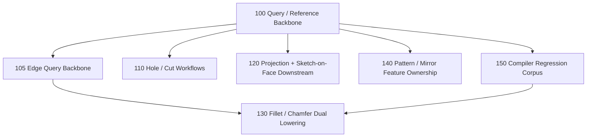

# Task Graph

Date: 2026-03-12

This is the multi-agent execution plan for the backend compiler program.

## Deepest Completed Prerequisite

Completed:

- [tasks/100-query-reference-backbone.md](../../../../../../tasks/100-query-reference-backbone.md)

What it gives the team:

- one shared `ShapeQueryOwner` contract
- one shared `FaceQueryRef` contract
- workplane provenance and tracked topology now use the same query model

This is the base that downstream feature agents should consume instead of inventing their own face/body provenance rules.

## Dependency Graph

## Can Start Immediately

These can start now from the current program tip:

- [tasks/105-edge-query-backbone.md](../../../../../../tasks/105-edge-query-backbone.md)
- [tasks/110-hole-and-cut-workflows.md](../../../../../../tasks/110-hole-and-cut-workflows.md)
- [tasks/120-projection-and-sketch-on-face-downstream.md](../../../../../../tasks/120-projection-and-sketch-on-face-downstream.md)
- [tasks/140-pattern-and-mirror-feature-ownership.md](../../../../../../tasks/140-pattern-and-mirror-feature-ownership.md)
- [tasks/150-compiler-regression-corpus.md](../../../../../../tasks/150-compiler-regression-corpus.md)

Blocked until edge-query work lands:

- [tasks/130-fillet-and-chamfer-dual-lowering.md](../../../../../../tasks/130-fillet-and-chamfer-dual-lowering.md)

## Merge Strategy

There is still one unavoidable shared surface area:

- `src/forge/compilePlan.ts`
- `src/forge/compilePlanManifold.ts`
- `src/forge/compilePlanCadQuery.ts`
- a few public API entry files

To keep agent work mergeable, use this operating model:

1. Feature agents build new feature logic in isolated modules first.
2. Each feature task should minimize central-file edits to a thin integration seam.
3. One integrator agent batches the small shared-file merges onto the program branch.

That keeps feature implementation parallel while acknowledging the real shared compiler seam.

## Recommended Team Topology

Core integrator lane:

- owns the program branch
- reviews query/lowering contracts
- batches the thin shared-file integration edits

Feature lanes:

- Hole/Cut lane: task 110
- Projection lane: task 120
- Pattern/Mirror lane: task 140
- Edge/Finishing lane: task 105 first, then task 130

Quality lane:

- Regression corpus lane: task 150

## File-Ownership Guidance

Task 105:

- may touch `src/forge/queryModel.ts`, `src/forge/sketch/topology.ts`, `src/forge/sketch/workplane*.ts`, and placement invariants
- should not implement fillet/chamfer behavior yet

Task 110:

- should prefer new feature modules and its own check/docs files
- should consume the shared face-query model and avoid changing query semantics

Task 120:

- should stay centered on projection/sketch-on-face semantics and exporter/runtime parity
- should avoid changing hole workflow files

Task 140:

- should focus on downstream ownership for repeated/mirrored feature results
- should avoid projection internals where possible

Task 150:

- should mostly live in `examples/`, `cli/check-*.ts`, and snapshot baselines
- should avoid core semantic changes
