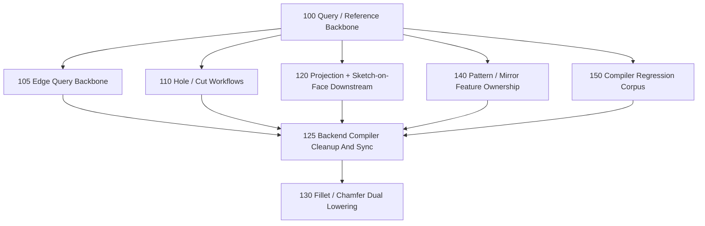

# Task Graph

Date: 2026-03-12

This is the multi-agent execution plan for the backend compiler program.

## Current Landed Base

Completed foundations and slices:

- [tasks/100-query-reference-backbone.md](../../../../../../tasks/100-query-reference-backbone.md)
- [tasks/105-edge-query-backbone.md](../../../../../../tasks/105-edge-query-backbone.md)
- [tasks/110-hole-and-cut-workflows.md](../../../../../../tasks/110-hole-and-cut-workflows.md)
- [tasks/120-projection-and-sketch-on-face-downstream.md](../../../../../../tasks/120-projection-and-sketch-on-face-downstream.md)
- [tasks/125-backend-compiler-cleanup-and-sync.md](../../../../../../tasks/125-backend-compiler-cleanup-and-sync.md)
- [tasks/140-pattern-and-mirror-feature-ownership.md](../../../../../../tasks/140-pattern-and-mirror-feature-ownership.md)
- [tasks/150-compiler-regression-corpus.md](../../../../../../tasks/150-compiler-regression-corpus.md)

What that gives the next lane:

- shared face and edge query/reference contracts
- hole/cut v1, projection replay v1, and repeated-result ownership in the compiler-owned subset
- curated multi-feature corpus coverage in compiler and exact-export checks

This is the base that task 130 consumed instead of inventing new provenance or regression surfaces locally.

## Dependency Graph

## Program State

- Landed: 100, 105, 110, 120, 125, 130, 140, and 150.
- Remaining queued lane in this slice: none yet. The next lane needs to be defined from the current architectural bottleneck, not guessed from the old queue.

## Next Up

- Define the next core lane around durable post-topology-change reference/query propagation.
- Build that lane as the foundation for broader fillet/chamfer, richer hole/cut variants, and wider projection-driven downstream workflows.

## Merge Strategy

There is still one unavoidable shared surface area:

- `src/forge/compilePlan.ts`
- `src/forge/compilePlanManifold.ts`
- `src/forge/compilePlanCadQuery.ts`
- a few public API entry files

To keep agent work mergeable, use this operating model:

1. Feature agents build new feature logic in isolated modules first.
2. Each feature task should minimize central-file edits to a thin integration seam.
3. One integrator agent batches the small shared-file merges onto the program branch.

That keeps feature implementation parallel while acknowledging the real shared compiler seam.

## Recommended Team Topology

Core integrator lane:

- owns the program branch
- reviews query/lowering contracts
- batches the thin shared-file integration edits

Next feature lane:

- To be defined next: durable post-topology-change reference/query propagation

Quality support:

- Extend the existing compiler corpus/checks as the next reference/query lane lands instead of spinning up a separate queue item first

## File-Ownership Guidance

Task 105:

- may touch `src/forge/queryModel.ts`, `src/forge/sketch/topology.ts`, `src/forge/sketch/workplane*.ts`, and placement invariants
- should not implement fillet/chamfer behavior yet

Task 110:

- should prefer new feature modules and its own check/docs files
- should consume the shared face-query model and avoid changing query semantics

Task 120:

- should stay centered on projection/sketch-on-face semantics and exporter/runtime parity
- should avoid changing hole workflow files

Task 140:

- should focus on downstream ownership for repeated/mirrored feature results
- should avoid projection internals where possible

Task 150:

- should mostly live in `examples/`, `cli/check-*.ts`, and snapshot baselines
- should avoid core semantic changes

Task 125:

- should focus on task/docs/corpus/tracker truthfulness
- should avoid changing feature semantics unless the cleanup exposes a real bug
